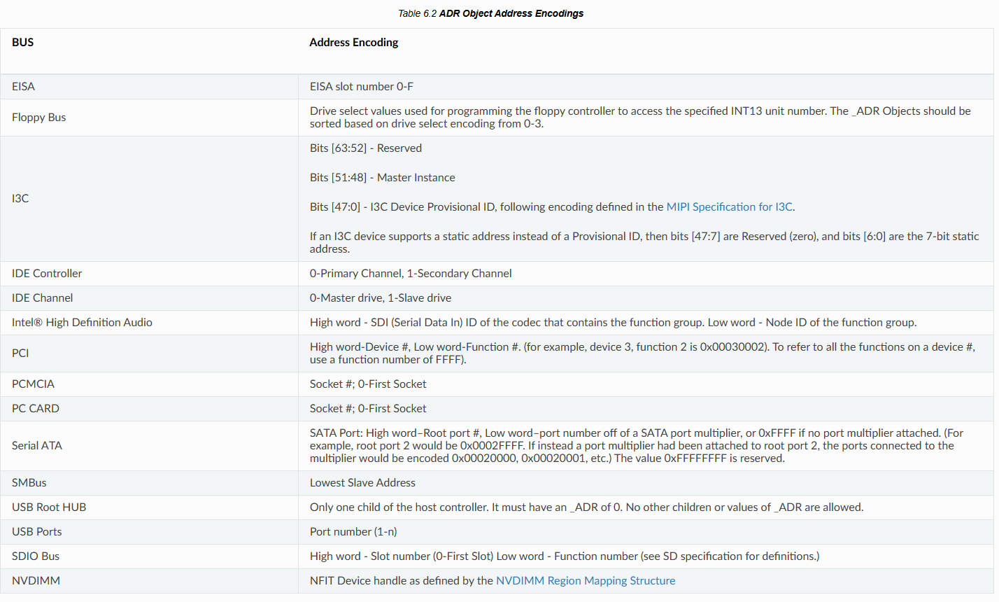
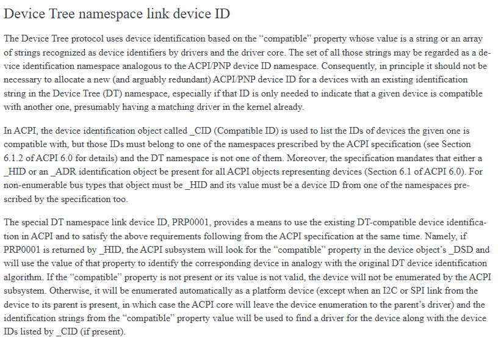
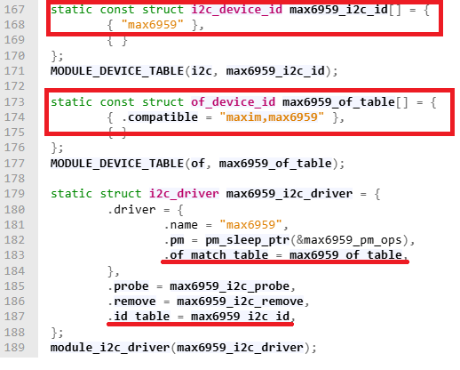
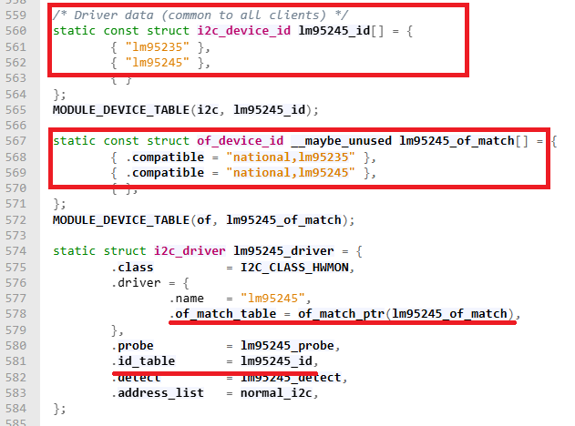
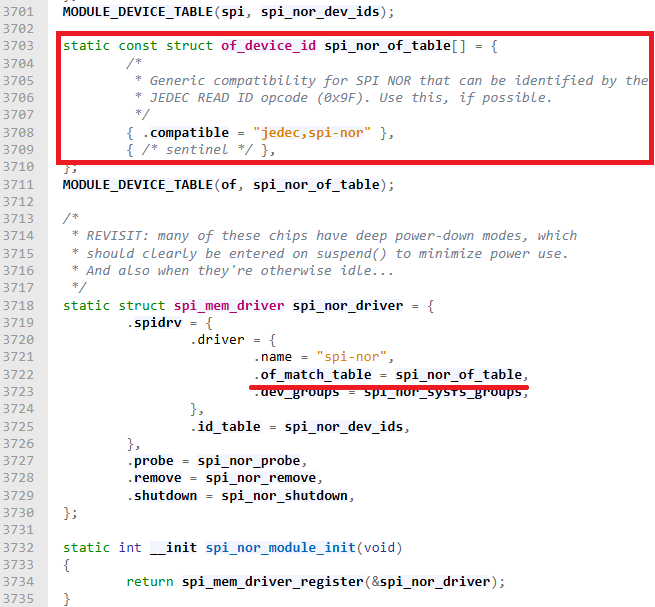
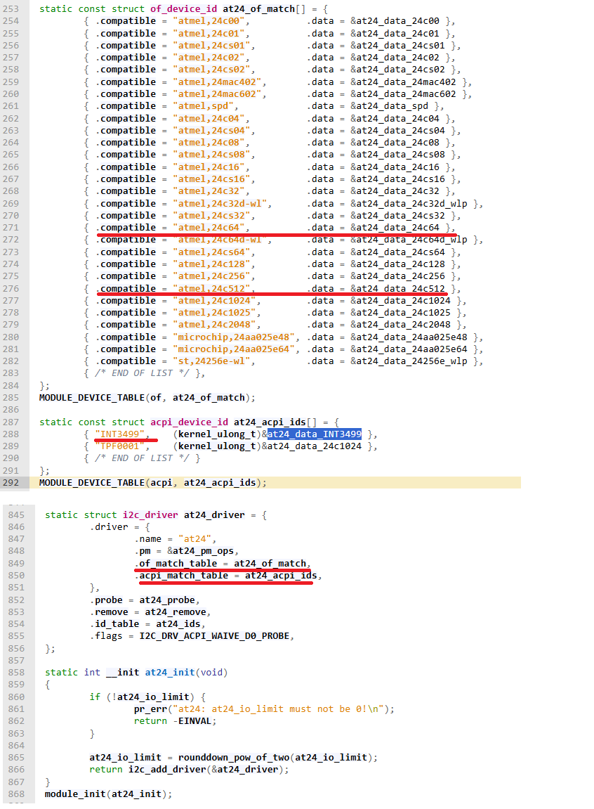

# ACPI Declaim Device Node

## MITT/WITT support UART、I2C、SPI and GPIO
  https://learn.microsoft.com/zh-tw/windows-hardware/drivers/spb/download-the-mitt-software-package

  * Download MITT software kit
     

## ACPI Method _HID _CID _DSD
*   _HID    Object that evaluates to a device’s Plug and Play hardware ID.

*   _CID    Object that evaluates to a device’s Plug and Play-compatible ID list.

    * https://uefi.org/htmlspecs/ACPI_Spec_6_4_html/06_Device_Configuration/Device_Configuration.html?highlight=_hid
  
*   _DSD    Object that evaluates to device specific information
    * "daffd814-6eba-4d8c-8a91-bc9bbf4aa301" UUID match
    * https://uefi.org/sites/default/files/resources/_DSD-device-properties-UUID.pdf

*   _ADR    An _ADR object must be used when specifying the address of any device on a bus that has a standard enumeration algorithm .

## Linux Kernel Document

* https://docs.kernel.org/firmware-guide/acpi/enumeration.html

## Linux Driver behavior
* _HID or _CID of ACPI table check driver ".acpi_match_table" if mathed the driver loaded.
* _HID and _CID of ACPI table if matched "PRP0001" 
    * compare driver ".of_match_table" list "compatible" with _DSD of ACPI table 
        * check _DSD of ACPI table reported "daffd814-6eba-4d8c-8a91-bc9bbf4aa301" presented 
        * check package reported "compatible", "atmel,24c64" matched with any ".of_match_table" then the driver loaded

## Sample ASL code

### Report I2C Postcode device Addr:0x38 in I2C1

* https://elixir.bootlin.com/linux/v6.17.1/source/drivers/auxdisplay/max6959.c
#  
    Scope(\_SB.PC00.I2C1) {
        Device (ADI2) {
            Name (_HID, "ADI0001")
             Name (_CID, "PRP0001")
            Name (_DDN, "Analog Device Inc, MAX6958")
            Name (_CRS, ResourceTemplate () {
                I2CSerialBus(0x0038, ControllerInitiated, 400000, AddressingMode7Bit, "\\_SB.PC00.I2C1", 0x00,  ResourceConsumer,,)
            })

            Name (_DSD, Package () {
                ToUUID("daffd814-6eba-4d8c-8a91-bc9bbf4aa301"),
                Package () {
                  Package () {"compatible", "maxim,max6959"},
                }
             })

            Method(_STA, 0, NotSerialized) { Return(0x0F) }
        }
    }

* Report Hardware monitor I2C device Addr:0x4C in I2CD

#
    Scope(\_SB.I2CD) {
        Device (TXN1) {
            Name (_HID, "TXN01B3")
            Name (_CID, "PRP0001")
            Name (_DDN, "Texas Insturments LM95245")
            Name (_CRS, ResourceTemplate () {
                I2CSerialBus(0x004C, ControllerInitiated, 400000, AddressingMode7Bit, "\\_SB.I2CD", 0x00, ResourceConsumer,,)
            })
            Name (_DSD, Package () {
                ToUUID("daffd814-6eba-4d8c-8a91-bc9bbf4aa301"),
                Package () {
                  Package () {"compatible", "national,lm95245"},
                }
             })
            Method(_STA, 0, NotSerialized) {Return(0x0F)}
        }
    }

### Report Hardware monitor I2C device Addr:0x51 in I2CD
#

    Scope(\_SB.I2CD) {
        Device (ADI1) {
            Name (_HID, "ADI0018")
            Name (_CID, "PRP0001")
            Name (_DDN, "Analog Device Inc, MAX31760")
            Name (_CRS, ResourceTemplate () {
                I2CSerialBus(0x0051,    ControllerInitiated, 400000,   AddressingMode7Bit, "\\_SB.I2CD", 0x00,   ResourceConsumer,,)
            })
            Name (_DSD, Package () {
                ToUUID  ("daffd814-6eba-4d8c-8a91-bc9bbf4aa301")  ,
                Package () {
                  Package () {"compatible", "adi,   max31760"},
                }
             })
            Method(_STA, 0, NotSerialized) { Return (0x0F)}
        }
    }

### Report SPI flash rom in SPI0

https://elixir.bootlin.com/linux/v6.17.1/source/drivers/mtd/spi-nor/core.c
#  
    Scope(\_SB.PC00.SPI0) {
        Device (SEP0) {
          Name (_HID, "PRP0001")
          Name (_DDN, "Macronix MX25L25645G")
          Name (_CRS, ResourceTemplate () {
            SpiSerialBus (0x0000, PolarityLow,  FourWireMode, 0x08,ControllerInitiated,  0x000F4240, ClockPolarityLow,    ClockPhaseFirst, "\\_SB.PC00.SPI0", 0x00,   ResourceConsumer, , )
          })
    
          Name (_DSD, Package () {
            ToUUID  ("daffd814-6eba-4d8c-8a91-bc9bbf4aa301"),
            Package () {
            Package () {"compatible", "jedec,spi-nor"},
            }
          })
    
          Method(_STA, 0, NotSerialized) { Return(0x0F)}
        }
    }

### Report I2C EEPROM device Addr:0x57 in I2CD

https://elixir.bootlin.com/linux/v6.17.1/source/drivers/misc/eeprom/at24.c
#
    Scope(\_SB.I2CD) {
        Device (EEP0) {
            Name (_HID, "INT3499")
            Name (_UID, 0)
            Name (_DDN, "Atmel AT24 compatible EEPROM")
            Name (_CRS, ResourceTemplate () {
                I2CSerialBus(0x0057, ControllerInitiated, 400000, AddressingMode7Bit, "\\_SB.I2CD", 0x00, ResourceConsumer,,)
            })

            Name (_DSD, Package () {
                ToUUID("daffd814-6eba-4d8c-8a91-bc9bbf4aa301"),
                Package () {
                    Package () {"size", 256},
                    Package () {"pagesize", 8},
                }
            })

            Method(_STA, 0, NotSerialized) {Return(0x0F)}
        }
    }

### Report I2C EEPROM device device Addr:0x50 in I2CD
#
    Scope(\_SB.I2CD) {
        Device (EEP2) {
            Name (_HID, "INT3499")
            Name (_CID, "PRP0001")
            Name (_DDN, "Atmel AT24C512 compatible EEPROM")
            Name (_CRS, ResourceTemplate () {
                I2CSerialBus(0x0050, ControllerInitiated, 400000, AddressingMode7Bit, "\\_SB.I2CD", 0x00, ResourceConsumer,,)
            })

            Name (_DSD, Package () {
                ToUUID("daffd814-6eba-4d8c-8a91-bc9bbf4aa301"),
                Package () {
                    Package () {"compatible", "atmel,24c512"},
                    Package () {"size", 65536},
                    Package () {"pagesize", 128},
                }
            })

            Method(_STA, 0, NotSerialized) {Return(0x0F)}
        }
    }

### Report I2C EEPROM device Addr:0x53 in I2CD
#
    Scope(\_SB.I2CD) {
        Device (EEP3) {
            //Name (_HID, "ATML2464")
            Name (_CID, "PRP0001")
            Name (_DDN, "Atmel AT24C64 compatible EEPROM")
            Name (_CRS, ResourceTemplate () {
                I2CSerialBus(0x0053, ControllerInitiated, 400000, AddressingMode7Bit, "\\_SB.I2CD", 0x00, ResourceConsumer,,)
            })

            Name (_DSD, Package () {
                ToUUID("daffd814-6eba-4d8c-8a91-bc9bbf4aa301"),
                Package () {
                    Package () {"compatible", "atmel,24c64"},
                    Package () {"size", 8192},
                    Package () {"pagesize", 32},
                }
            })

            Method(_STA, 0, NotSerialized) {Return(0x0F)}
        }
    }

### Report Bosch bme280 in GSPI2 work
<https://www.bosch-sensortec.com/media/boschsensortec/downloads/datasheets/bst-bme280-ds002.pdf>

<https://www.taiwaniot.com.tw/product/gy-bme280-3-3-%E9%AB%98%E7%B2%BE%E5%BA%A6-%E5%A4%A7%E6%B0%A3%E5%A3%93%E5%BC%B7%E6%84%9F%E6%B8%AC%E5%99%A8%E6%A8%A1%E7%B5%84-%E9%AB%98%E5%BA%A6%E8%A8%88/?srsltid=AfmBOop-e9IW7Avu14W-4I9zvT5I7E35rGavWvKLUpWWrc741rvmWvvd>
#
    Device (SEP8) {
      Name (_HID, "PPP0001")

      Method(_CRS, 0x0, NotSerialized)
      {
        Name (RBUF, ResourceTemplate ()
        {
            SpiSerialBus (0x0000, PolarityLow, FourWireMode, 0x08,ControllerInitiated, 0x000F4240, ClockPolarityLow,ClockPhaseFirst, "\\_SB.PC00.SPI2", 0x00, ResourceConsumer, , )
        })

        Return(RBUF)
      }

      Name (_DSD, Package () {
        ToUUID  ("daffd814-6eba-4d8c-8a91-bc9bbf4aa301"),
        Package () {
          Package () {"compatible", "bosch,bme280"}
        }
      })

      Method(_STA, 0, NotSerialized) { 
          Return(0x0F)
      }

    } //Device (SEP0)

