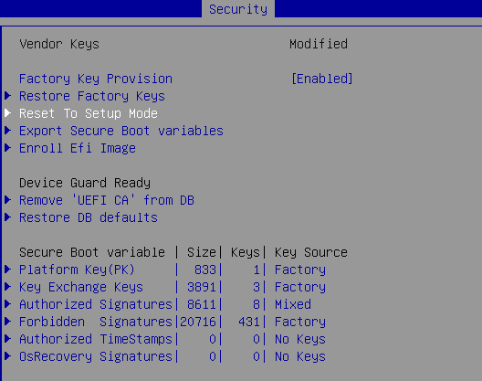
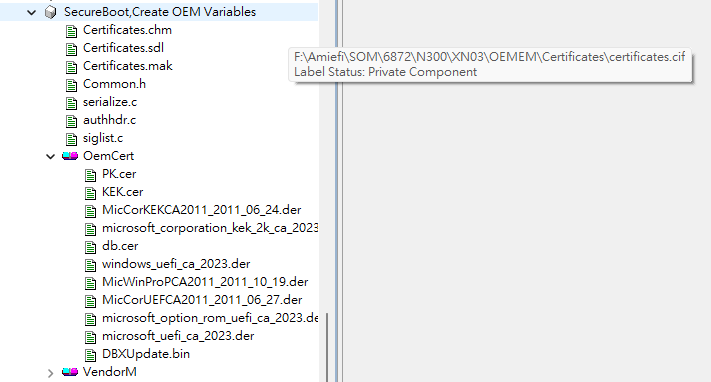
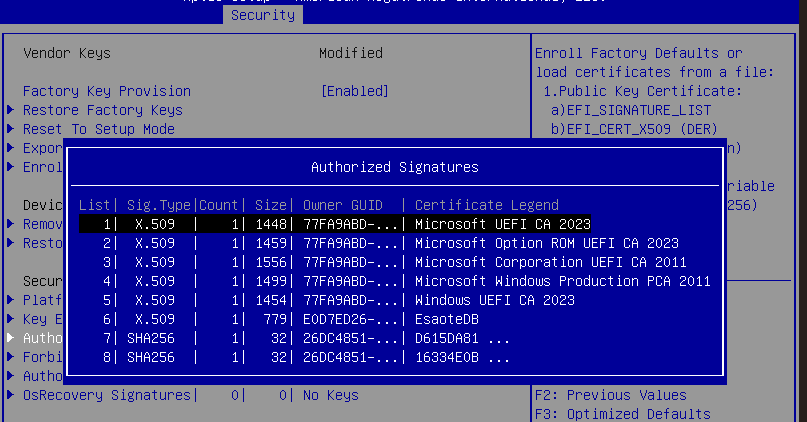
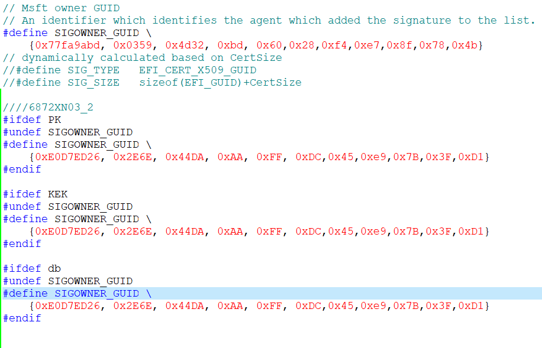
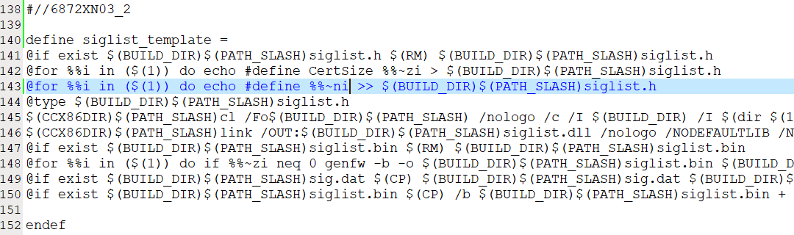
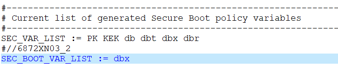
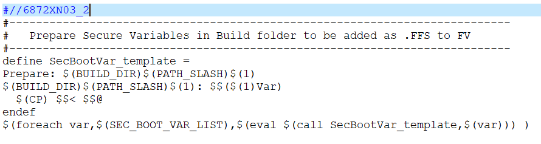
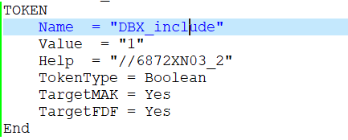
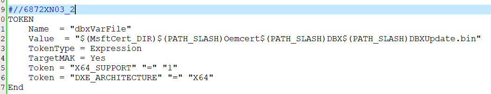

<div align=center></div>

# AMI Secure Boot

## Agenda

* Customer Default Key Provision
* Secure Boot Varable
* Secure Boot Setup and Tokens
* Secure Boot Default Key Provision
* Update Secure Boot Key Module 

### Customer Default Key Provision

* BIOS include public keys PK, KEK, DB, DBX using "Certificates eModule" 
* BIOS default set "DEFAULT_PROVISION_SECURE_VARS" to 1
* BIOS enroll keys at DXE phase via "SecureBootDXE" driver during SetupMode == 1
* The "SecureBootDXE" driver return EFI_UNLOAD_IMAGE caused the image will unload after dispatchF

### Secure Boot Varable

* AMI defined variable ==> AMI_SECURE_BOOT_SETUP_VAR  L"SecureBootSetup"
* The "SecureBootSetup" variable only could be modified in Admin mode of BIOS Setup.
* The "SecureBootSetup" variable default would be reserved during flashing BIOS.
 ```
typedef struct{
    UINT8 SecureBootSupport;   ///< Setup control
    UINT8 SecureBootMode;      ///< Setup control
    UINT8 DefaultKeyProvision; ///< Setup control
    UINT8 Reserved;            ///< reserved
    UINT8 Load_from_OROM;      ///< Setup control
    UINT8 Load_from_REMOVABLE_MEDIA; ///< Setup control
    UINT8 Load_from_FIXED_MEDIA; ///< Setup control
} SECURE_BOOT_SETUP_VAR;
 ```

### Secure Boot Setup and Tokens
* SecureBootSupport of SECURE_BOOT_SETUP_VAR is control by Secure Boot item
* "DEFAULT_SECURE_BOOT_ENABLE" token is Secure Boot item default setting
* SecureBootMode of SECURE_BOOT_SETUP_VAR is control by Secure Boot Mode item
* "DEFAULT_SECURE_BOOT_MODE" token is Secure Boot Mode item default setting


* DefaultKeyProvision of SECURE_BOOT_SETUP_VAR is control by Factory Key Provision item

* "DEFAULT_PROVISION_SECURE_VARS" token is Factory Key Provision item default setting



* Restore Factory Keys is interactive item to reload default keys 

* Reset to Setup Mode is interactive item to remove keys 

* Enroll EFI image is interactive item to add hash EFI image data and let it load in Secure Boot mode 

### Secure Boot Default Key Provision

* BIOS add "Certificates eModule" to include PK, KEK, DB, DBX keys 
* "Certificates eModule" can support public key (cer or der format) to Authenticated variable


### Update Secure Boot Key Module 

* Customer using Owner GUID 



* "Certificates eModule" need to update

* Add Customer's Owner GUID



* Update makefile to match keyname and re-define "Owner GUID"



* Update makefile to support Authenticated Variable
 


* Update SDL file



### Secure Boot Key Data Struture
#### EFI_VARIABLE_AUTHENTICATION = AMI_EFI_VARIABLE_AUTHENTICATION_2 + EFI_SIGNATURE_LIST_1 + Public Key
 ```
typedef struct {
  ///
  /// Type of the signature. GUID signature types are defined in below.
  ///
  EFI_GUID            SignatureType;
  ///
  /// Total size of the signature list, including this header.
  ///
  UINT32              SignatureListSize;
  ///
  /// Size of the signature header which precedes the array of signatures.
  ///
  UINT32              SignatureHeaderSize;
  ///
  /// Size of each signature.
  ///
  UINT32              SignatureSize;
  ///
  /// Header before the array of signatures. The format of this header is specified
  /// by the SignatureType.
  /// UINT8           SignatureHeader[SignatureHeaderSize];
  ///
  /// An array of signatures. Each signature is SignatureSize bytes in length.
  /// EFI_SIGNATURE_DATA Signatures[][SignatureSize];
  ///
} EFI_SIGNATURE_LIST;

typedef struct {
    EFI_SIGNATURE_LIST   SigList;
    EFI_GUID             SigOwner;
} EFI_SIGNATURE_LIST_1;

typedef struct {
  WIN_CERTIFICATE   Hdr;
  EFI_GUID          CertType;
//  UINT8            CertData[1];
//    EFI_CERT_BLOCK_RSA_2048_SHA256  CertData;
} WIN_CERTIFICATE_UEFI_GUID_1;

typedef struct {
    EFI_TIME                            TimeStamp;
    WIN_CERTIFICATE_UEFI_GUID_1         AuthInfo;
} AMI_EFI_VARIABLE_AUTHENTICATION_2;
 ```

