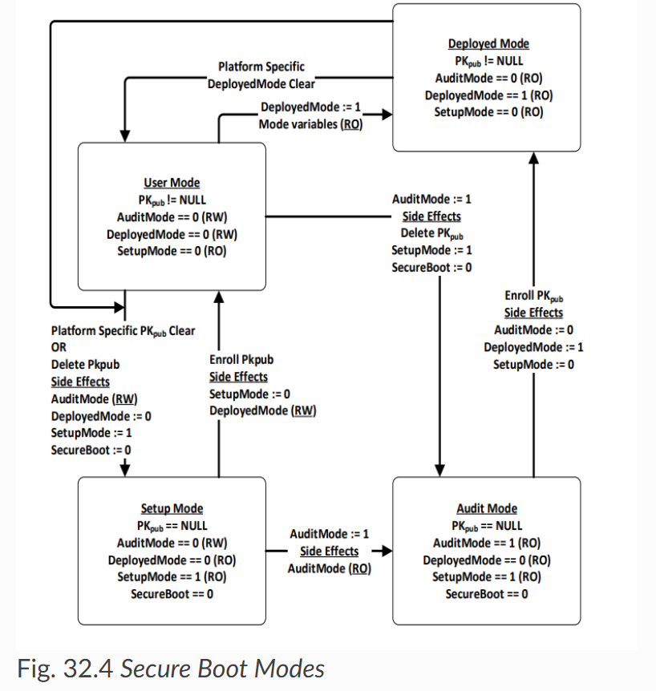

EFI Secure Boot
===============

Agenda
------
## UEFI Secure Boot
* EFI Secure Boot Mode
* EFI Secure Boot Varable

## AMI Secure Boot
* AMI Secure Boot Varable
* AMI Secure Boot Setup
* AMI Secure Boot Tokens
* Secure Boot Default Keys

### EFI Secure Boot Mode

https://uefi.org/specs/UEFI/2.11/32_Secure_Boot_and_Driver_Signing.html#secure-boot-modes

* Setup Mode    : PKpub == NULL; AuditMode(RW) == 0; DeployedMode(RO) == 0; SetupMode(RO) == 1; SecureBoot == 0
* User Mode     : PKpub != NULL; AuditMode(RW) == 0; DeployedMode(RW) == 0; SetupMode(RO) == 0; SecureBoot == 1
* Depolyed Mode : PKpub != NULL; AuditMode(RO) == 0; DeployedMode(RO) == 1; SetupMode(RO) == 0; SecureBoot == 1
* Audit Mode    : PKpub == NULL; AuditMode(RO) == 1; DeployedMode(RO) == 0; SetupMode(RO) == 1; SecureBoot == 0

After enroll Platform Key (PK), the SetupMode variable set to 0. (Enter User mode)

### EFI Secure Boot Varable

#### EFI Secure Boot Varable (SetupMode)

#define EFI_GLOBAL_VARIABLE { 0x8BE4DF61, 0x93CA, 0x11d2, {0xAA, 0x0D, 0x00, 0xE0, 0x98, 0x03, 0x2B, 0x8C } }
#define EFI_SETUP_MODE_NAME                         L"SetupMode"

#### EFI Secure Boot Varable (SecureBoot)

#define EFI_GLOBAL_VARIABLE { 0x8BE4DF61, 0x93CA, 0x11d2, {0xAA, 0x0D, 0x00, 0xE0, 0x98, 0x03, 0x2B, 0x8C } }
#define EFI_SECURE_BOOT_MODE_NAME                   L"SecureBoot"

#### EFI Secure Boot Key Varable

#define EFI_GLOBAL_VARIABLE { 0x8BE4DF61, 0x93CA, 0x11d2, {0xAA, 0x0D, 0x00, 0xE0, 0x98, 0x03, 0x2B, 0x8C } }
#define EFI_KEY_EXCHANGE_KEY_NAME                   L"KEK"
#define EFI_PLATFORM_KEY_NAME                       L"PK"
#define EFI_SIGNATURE_SUPPORT_NAME                  L"SignatureSupport"

##### EFI Secure Boot Varable (default keys)

#define EFI_KEK_DEFAULT_VARIABLE_NAME               L"KEKDefault"
#define EFI_PK_DEFAULT_VARIABLE_NAME                L"PKDefault"
#define EFI_DB_DEFAULT_VARIABLE_NAME                L"dbDefault"
#define EFI_DBX_DEFAULT_VARIABLE_NAME               L"dbxDefault"
#define EFI_DBT_DEFAULT_VARIABLE_NAME               L"dbtDefault"
#define EFI_VENDOR_KEYS_VARIABLE_NAME               L"VendorKeys"

#### Secure Boot Varable

* #define AMI_SECURE_BOOT_SETUP_VAR  L"SecureBootSetup"
* #define AMI_SECURE_VAR_PRESENT_VAR  L"SecureVarPresent"
* #define AMI_DEPLOYMENT_MODE_VARIABLE_NAME  L"DeploymentModeNv"
* #define EFI_VENDOR_KEYS_NV_VARIABLE_NAME  L"VendorKeysNv"

typedef struct{
    UINT8 SecureBootSupport;   ///< Setup control
    UINT8 SecureBootMode;      ///< Setup control
    UINT8 DefaultKeyProvision; ///< Setup control
    UINT8 Reserved;            ///< reserved
    UINT8 Load_from_OROM;      ///< Setup control
    UINT8 Load_from_REMOVABLE_MEDIA; ///< Setup control
    UINT8 Load_from_FIXED_MEDIA; ///< Setup control
} SECURE_BOOT_SETUP_VAR;

typedef struct{
    UINT8 Value; ///< SetupMode var value
} SETUP_MODE_VAR;

typedef struct{
    UINT8 Value; ///< SecureBoot var value
} SECURE_BOOT_VAR;

typedef struct{
    UINT8 Value; ///< AuditMode var value
} AUDIT_MODE_VAR;

typedef struct{
    UINT8 Value; ///< DeployedMode var value
} DEPLOYED_MODE_VAR;

typedef struct{
    UINT8 Value; ///< VendorKey variable value
} SECURE_BOOT_VENDOR_KEY_VAR;

#### Secure Boot Detail

#### Secure Boot Default Keys

#### Reference Link
        https://uefi.org/sites/default/files/resources/Using%20Python%203%20in%20the%20UEFI%20Shell%20for%20Platform%20Security%20Analysis_Final%208.15.2022.pdf

