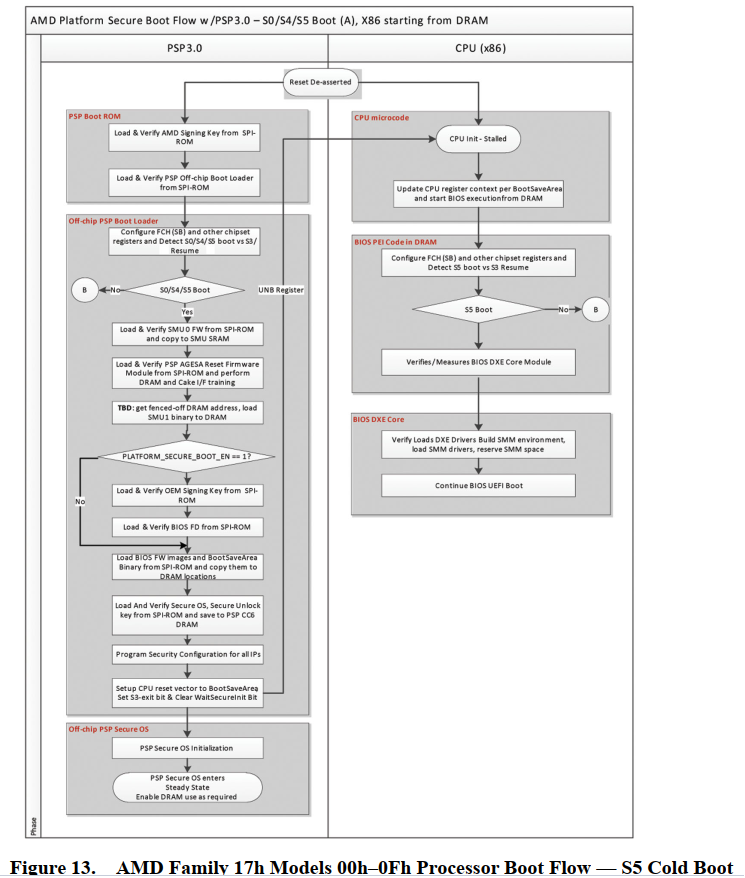

AMD **P**latform **S**ecure **B**oot
========================

Agenda
------
*   AMD PSB Enablement
    *   PSB signing key process
    *   BIOS Check List
    *   BIOS verify registers
    *   BIOS Resign image
    *   Refer documents

# PSB signing key process refer document 56535
* Register ODM/OEM AMD POC
* Receive Platform Vendor ID from AMD POC
* Create ODM/OEM BIOS signing key pair
* Send Certificate Signing Request to AMD POC
* Confirm authenticity of certificate signing request to AMD POC
* Receive certificate file from AMD POC

# BIOS Check List
* Makesure gEfiAmdAgesaModulePkgTokenSpaceGuid.PcdAmdPspAutoPsb is true
* Makesure Image entry 0x05 in BIOS DIR L1 and L2
* Makesure Image entry 0x07 in BIOS DIR L1 and L2
* Combine RTM-Image (Image entry 0x62) and BIOS DIR L1 header
* Combine RTM-Image (Image entry 0x62)and BIOS DIR L1 header and BIOS DIR L2 header
* Sign combine binaries RTM+L1 and RTM+L1+L2
* Reverse signature file of RTM+L1 and RTM+L1+L2 
* Rebuild BIOS image with new signature files

# BIOS verify registers
* Read MP0_C2P_MSG_38 register in shell or OS
    * mm fd210994 -w 4 -n
* Read MP0_C2P_MSG_37 register in shell or OS
    * mm fd210998 -w 4 -n

# BIOS Resign image
* Using private key of HSM server to resign BIOS image
    
    python Resign.py --bios 68720050060V301.rom --project_id 0002 --passphrase Advantech

* Using local private key to resign BIOS image

    python Resign.py --bios 68720060060V301.rom --project_id 0002 --passphrase Advantech --publickey Advantech_A3110000_0xBCEFEC2B-AMD_renoir.stkn --privatekey Advantech_bios_signing.key

# Refer documents
* AMD Platform Security Processor BIOS Architecture Design Guide
    * \\biosserver.advantech.corp\BIOS_ROOT\Specs\AMD\CHIPSET\V-SERIES\V2000_FP6\Platform_Design\55758_2.04.pdf

* Enabling Platform Secure Boot for AMD Family 17h Processor Based Client Platforms User’s Guide
    * \\biosserver.advantech.corp\BIOS_ROOT\Specs\AMD\CHIPSET\V-SERIES\V2000_FP6\Software_Docs\56654_1.00_Enabling Platform Secure Boot.pdf

* Platform Secure Boot CE Enablement
    * \\biosserver.advantech.corp\BIOS_ROOT\Specs\AMD\CHIPSET\V-SERIES\V2000_FP6\Infrastructure\PSB_Training_Slide_deck.pdf

* BIOS Signing Key Pair Generation and Certificate Request Process
    * \\biosserver.advantech.corp\BIOS_ROOT\Specs\AMD\CHIPSET\V-SERIES\V2000_FP6\Software_Docs\56535_0.7.pdf

