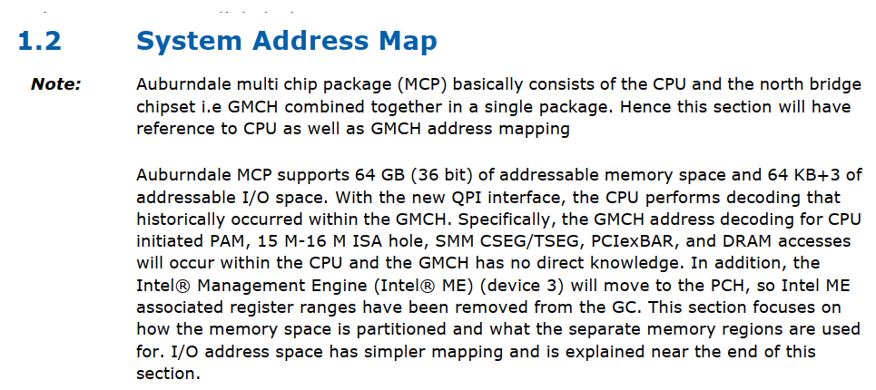
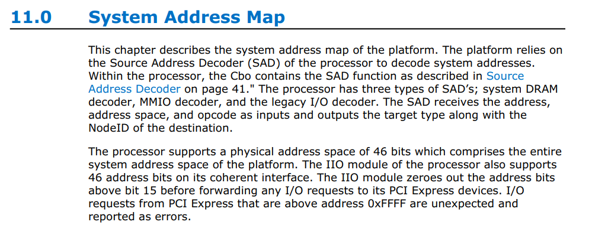
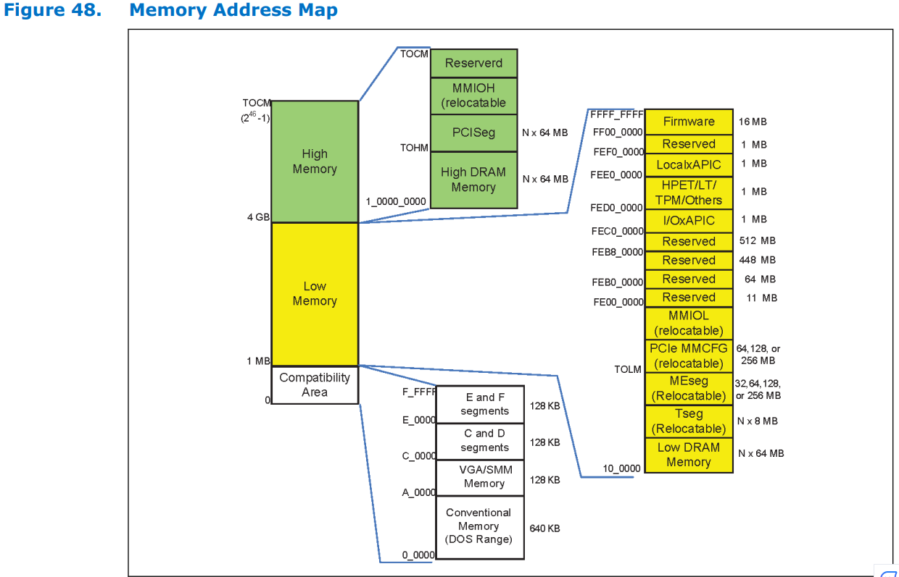
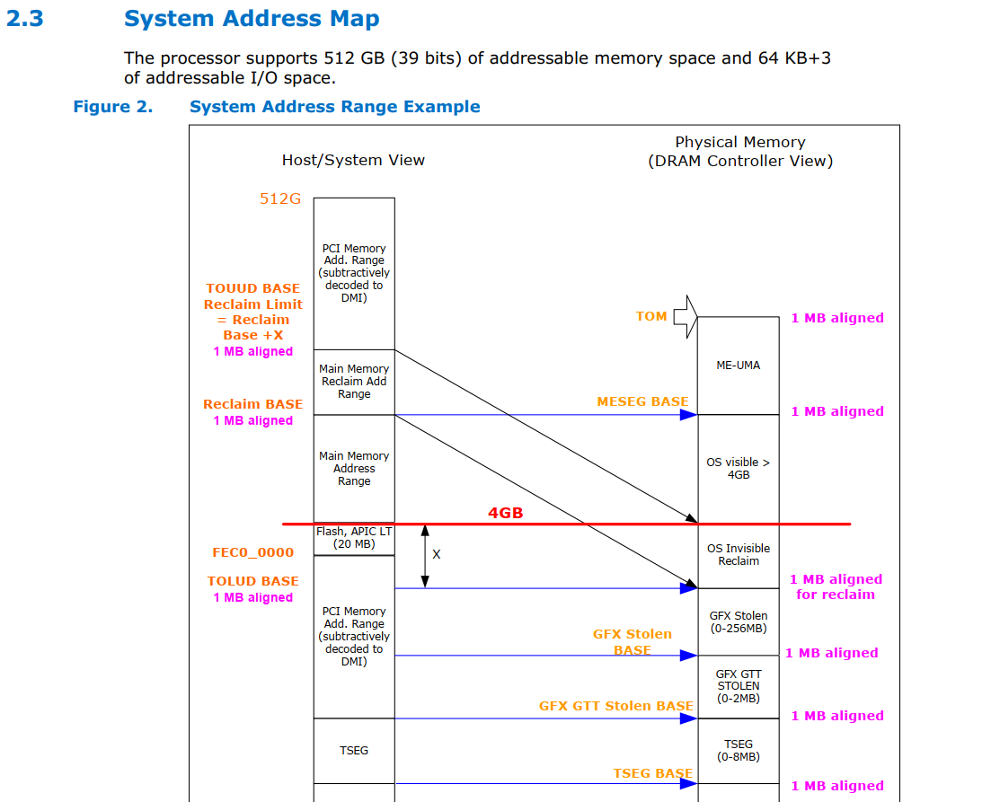
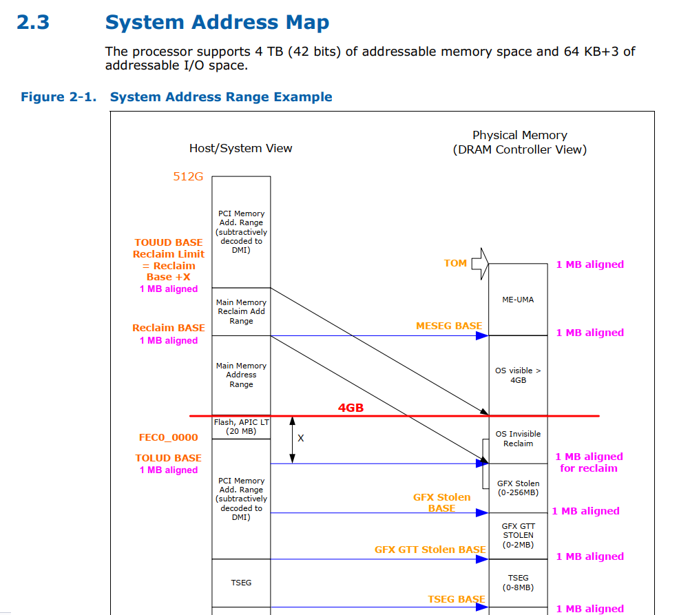
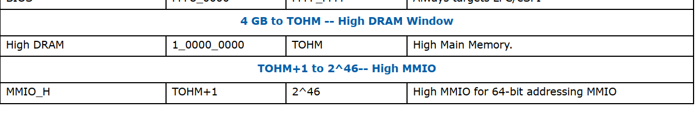

Intel CPU
========================

Agenda
------
*   Intel Processor Support 

# Intel Auburndale System Address Map
## Intel Auburndale Processors Address support to 64 GB (36bit)

* \\biosserver.advantech.corp\BIOS_ROOT\Specs\INTEL\CHIPSET\2010-Calpella\EDS\Auburndale\416057_416057_ARR_EDS_Vol2.pdf

# Intel® Xeon® Processor D-1500
## Intel Xeon® Processor D-1500 Processors Address support to  64 TB (46bit)

* \\biosserver.advantech.corp\BIOS_ROOT\Specs\INTEL\CHIPSET\2015-BoardwellDE\Broadwell-DE - Technical\544040_D_1500_EDS_Vol1_544040_v2_0.pdf

# Intel Skylake Processor System Address Map
## Intel Skylake Processor Address support to 512 GB (39bit)

* \\biosserver.advantech.corp\BIOS_ROOT\Specs\INTEL\CHIPSET\2015-Skylake\Embedded Platform Code Named Skylake-H including the Skylake-H BGA Processor with 100  C200 Series PCH\Client Processors Skylake Processors for Skylake Platforms - Technical\544925_544925_Skylake_EDS_Vol_2_Rev_0.95.pdf

# 12th Generation Intel® Core™ Processors
## Intel 12th Processors Address support to 4T GB (42bit)

* \\biosserver.advantech.corp\BIOS_ROOT\Specs\INTEL\CHIPSET\2021-AlderLake\AlderlakeP\EDS\619503_ADL_P_M_EDS_Vol2_Rev1p11.pdf

# Intel® Xeon® Processor D-1700 and D-2700 
## Intel Xeon D-1700 and D-2700 Processors Address support to  64 TB (46bit)

* \\biosserver.advantech.corp\BIOS_ROOT\Specs\INTEL\CHIPSET\2019-IceLake\IceLakeD\Idaville HCC\Datasheets and Specifications\618610_ICXD_HCC_EDS_Vol1_Rev1_5.pdf
