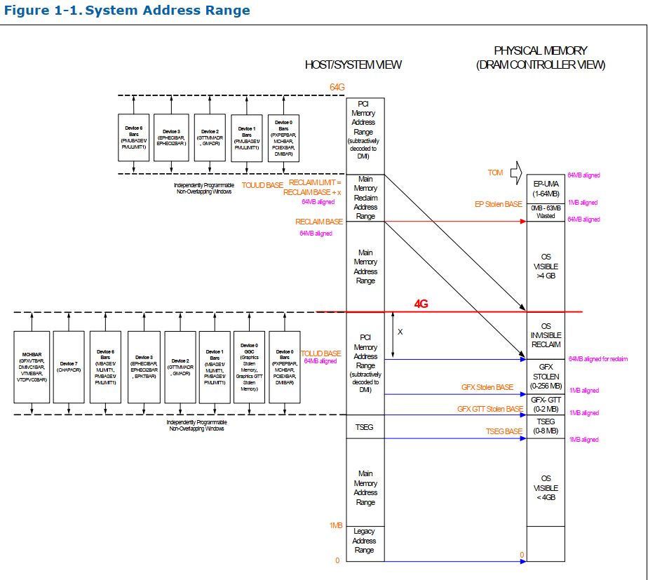

Intel CPU
========================

Agenda
------
*   Intel Processor Support 

# Intel Auburndale System Address Map
* Intel  Auburndale multi chip package 64 GB (36bit)

* \\biosserver.advantech.corp\BIOS_ROOT\Specs\INTEL\CHIPSET\2010-Calpella\EDS\Auburndale\416057_416057_ARR_EDS_Vol2.pdf
