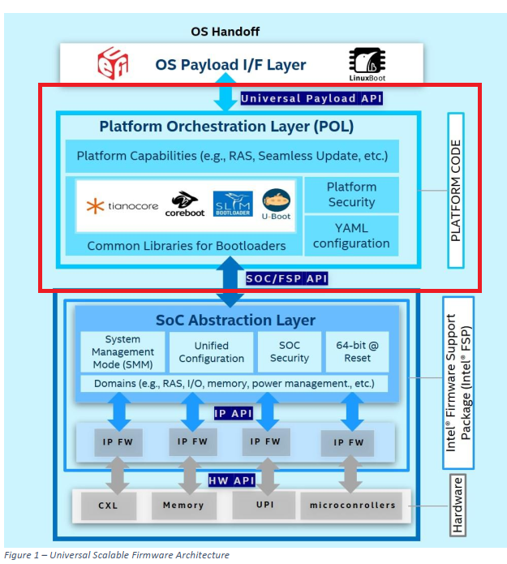
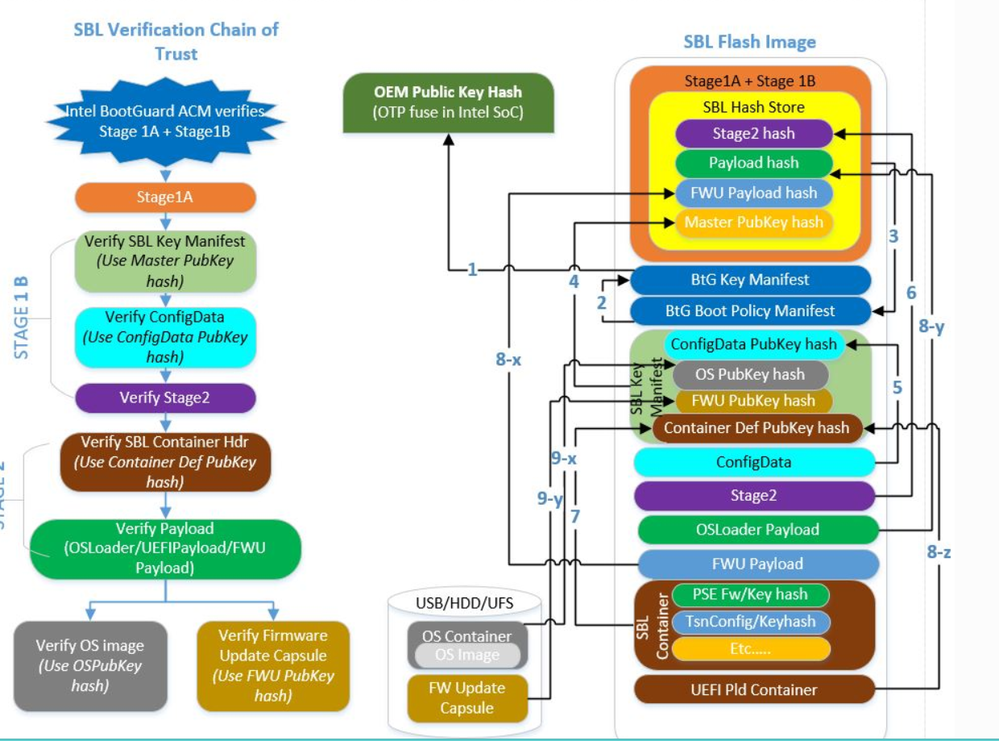
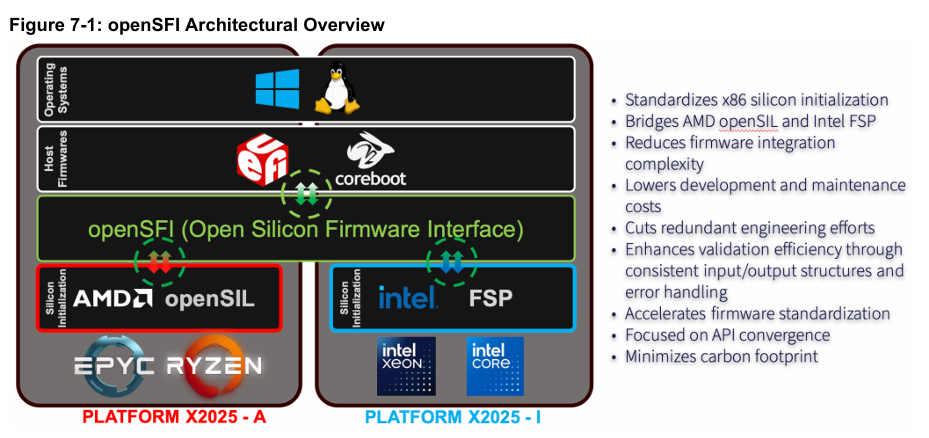
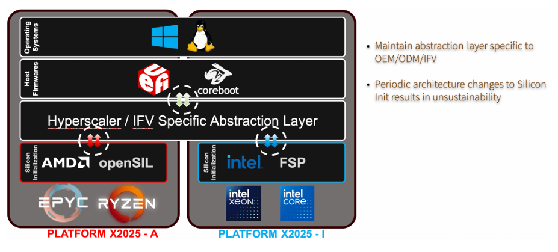
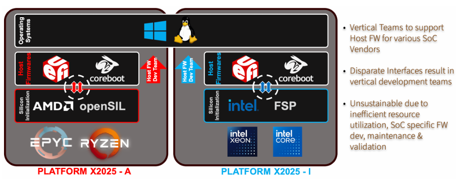

Universal Scalable Firmware
===========================

Agenda
------
*   Universal Scalable Firmware
*   Open Platform Firmware

# Universal Scalable Firmware
## Universal Scalable Firmware

* https://github.com/UniversalScalableFirmware/Introduction/blob/main/USF_Overview.pdf

## Slim Bootloader
### Slim Bootloader is designed with the modular approach by providing hardware initialization, then launching a payload to boot OS.

* https://slimbootloader.github.io/introduction/index.html

# Open Platform Firmware
## Open Silicon Firmware Interface

* https://www.opencompute.org/documents/open-silicon-firmware-interface-opensfi-specification-v0-3-pdf
* https://www.opencompute.org/events/past-events/2024-ocp-global-summit#open-platform-firmware-opf
* https://drive.google.com/file/d/1e5SoQi6DVjSlXEZl4f33b8hGJg15k04d/view?usp=drive_link

## Create internal abstraction layers by platform owners

*       https://www.opencompute.org/documents/open-silicon-firmware-interface-opensfi-specification-v0-3-pdf

## Problem Statement

## openSIL (Open-Source Silicon Initialization Library)
* https://github.com/openSIL/openSIL
* https://www.opencompute.org/documents/firmware-architecture-specification-opensil-v1-0-pdf
* https://github.com/amd/firmware_binaries
* https://www.reddit.com/r/Amd/comments/1f9qw2n/amd_reveals_latest_plans_for_opensource_opensil/?tl=zh-hant&rdt=56011

