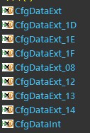
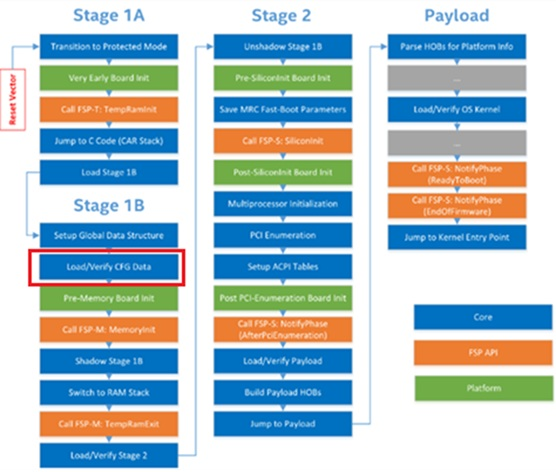
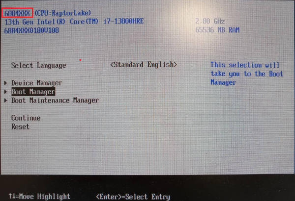

# Update board-specific configuration settings by the SBL tool

**My steps**

**1. Export CfgData from IFWI binary**

After run below command, the tool will exporting external CFGDATA for each Platform ID (e.g CfgDataExt_1E.bin).

```
python D:\SBL\slimbootloader\BootloaderCorePkg\Tools\CfgDataTool.py export -i Outputs\rplp\688400S0180V108.bin -o Outputs\rplp\
```






**2. Config board specific data by ConfigEditor**

Open the GUI interface. After launching, Load YAML using the following YAML file: **CfgDataDef.yaml**. Then Load Config Data from binary using CfgDataExt_1E.bin.

```
python D:\SBL\slimbootloader\BootloaderCorePkg\Tools\ConfigEditor.py
```

**Outputs\rplp\CfgDataDef.yaml**

After loading, modify the "Platform Name" field from **"688400S"** to **"6884XXX"**.

Save Config Data to DLT, and named the file CfgDataExt_1E.dlt .

**3. Generate modified IFWI binary**

TODO: Combine below command as one batch.

**3.1**
```
python BootloaderCorePkg\Tools\GenCfgData.py GENBIN Outputs\rplp\CfgDataDef.yaml;Outputs\rplp\CfgDataExt_1E.dlt Outputs\rplp\TEMP.bin
```

**3.2**
```
python BootloaderCorePkg\Tools\CfgDataTool.py merge -o Outputs\rplp\CfgDataExt_MOD.bin Outputs\rplp\CfgDataInt.bin Outputs\rplp\TEMP.bin
```

**3.3**
```
python D:\SBL\slimbootloader\BootloaderCorePkg\Tools\CfgDataTool.py sign -o Outputs\rplp\CfgDataExt_MOD_SIGN.bin -k KEY_ID_CFGDATA_RSA3072 -a SHA2_384 -s RSA_PSS -svn 0 Outputs\rplp\CfgDataExt_MOD.bin
```

**3.4**
```
python BootloaderCorePkg\Tools\CfgDataTool.py replace -i Outputs\rplp\688400S0180V108.bin Outputs\rplp\CfgDataExt_MOD_SIGN.bin -o Outputs\rplp\NEW.bin
```

## Test Result


